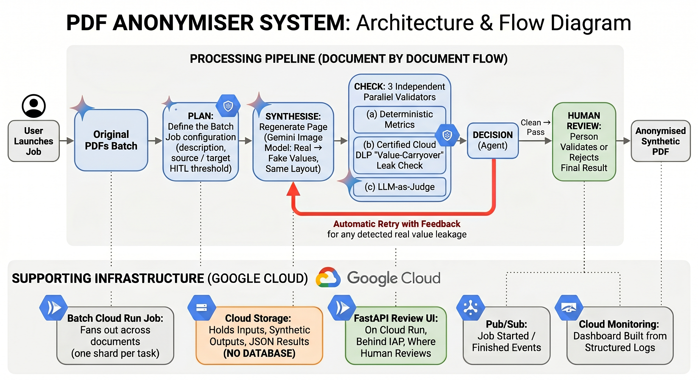

# PDF Anonymiser

Turn a folder of PDFs that contain personal data into a **PII-free** set you can share,
with a **human in the loop**. Instead of masking — which wrecks the layout and misses values
like the printed name under a signature — it **regenerates** each page with every real value
swapped for a realistic *synthetic* one of the same type, format and place, so the document
stays genuine-looking while carrying no real PII. **Cloud Storage only — no database.**


<sub>The demo loops above · [watch the full-resolution video](docs/video_pdf.mp4)</sub>

**How it works** — page by page:

1. **Plan** — a free-text description → a scoped PII-type list (Gemini **Flash**).
2. **Scan** — read by **Gemini vision ∪ Cloud DLP** — PII *types + location*, never values.
3. **Synthesise** — the **Gemini image model** (Nano Banana) regenerates the page: real
   values → realistic fakes, layout intact.
4. **Check** — three independent signals: deterministic **metrics**, a **certified DLP
   value-carryover** check, and an **LLM-as-judge**. A leak triggers an **automatic retry
   with targeted feedback** (bounded); otherwise the page is done.
5. **Review** — worst-scoring first, a human **validates** or **rejects**.

Steps 3–4 run as a small **redaction agent** that calls each signal — and the retry/stop
decision — as an explicit, swappable tool; the decision tool is deterministic, so the leak
gate stays auditable.

→ Pipeline detail: **[docs/PIPELINE.md](docs/PIPELINE.md)** · design (GCS-only store,
exactly-once latch, concurrency): **[docs/ARCHITECTURE.md](docs/ARCHITECTURE.md)**.

## Architecture



Two runtime pieces over a **Cloud Storage-only** store (no database):

- a **batch Cloud Run Job** that fans out across the source PDFs — each task takes a
  round-robin shard of documents and processes them page by page, writing one immutable
  JSON result + the synthetic PDF per document;
- a **FastAPI + HTMX review UI** (Cloud Run service, behind **IAP**) that reads those
  results live, drives the human validate/reject flow, and triggers relaunches.

**Pub/Sub** carries `started`/`finished` job events; **Cloud Monitoring** turns the app's
structured logs into a dashboard. See **[docs/ARCHITECTURE.md](docs/ARCHITECTURE.md)** for
the GCS layout, the exactly-once completion latch, and the concurrency model.

## Ratings & review

Each page is rated by three independent signals; a document takes the **worst** of its pages.

| Signal | What it measures |
|---|---|
| **removal recall** | share of the source's detected PII whose exact value no longer appears in the output |
| **fidelity** | share of the *non-PII* text left unchanged (fuzzy — tolerant of OCR noise) |
| **score** | overall quality = **F1** of recall and fidelity = `2·r·f / (r+f)` — high only if *both* are |
| **DLP carryover** | Cloud DLP re-scans the output for surviving real values — *certified* types (IBAN…) vs *soft* (`name`/`other`) |
| **AI judge** | a vision check: all PII replaced? layout preserved? any value leaked? |

| Tag | When |
|---|---|
| 🟢 **pass** | nothing leaked, fidelity ≥ threshold, judge satisfied — every signal agrees |
| 🟡 **review** | nothing *certainly* leaked, but a doubt: fidelity below threshold, a soft DLP `name`/`other` hit, or the judge flags incomplete replacement / layout drift |
| 🔴 **fail** | a real value survived — the exact value-match, a *certified* DLP type, or the judge says leaked |
| ⚫ **error** | the page/document failed to process (e.g. a timeout) — relaunch it from the UI |

**Human review** is triggered when a document's tag isn't `pass`, **or** its score is below the
**score threshold**. The **fidelity** and **score** thresholds are sliders at launch (default
`0.85`) — either one below its bar sends the document to a reviewer; clean, high-scoring
documents auto-approve.

---

## Quickstart (local, no cloud)

```bash
make install   # venv + deps
make test      # the unit suite (no network)
make serve     # review UI on http://localhost:8080
```

The UI runs locally; the anonymisation itself calls Gemini, so a real run needs a GCP
project — see **Deploy**.

## Deploy to your GCP project (one command)

```bash
gcloud auth login && gcloud auth application-default login   # once
cp infra/environments/dev.tfvars.example infra/environments/dev.tfvars
$EDITOR infra/environments/dev.tfvars                        # project_id, region, IAP allowlist
make setup                                                   # APIs → image → terraform apply
```

`make setup` prints the UI URL and bucket when done. Re-run any time; `make destroy` tears
it down. Needs `gcloud` + `terraform`; the image builds in the cloud (no local Docker).
Terraform state lives in a GCS bucket (`make tf-backend` creates it) — team-operable, with
locking. *(Upgrading an existing local-state deploy? Migrate once — see `infra/versions.tf`.)*

- **Pick models:** `make models` shows what your project can call and prints a recommended
  block; `make models-write [LOC=global|europe-west4]` writes it into your tfvars.
- **Secure the UI:** it shows real PII, so it ships with **IAP** on (`enable_iap=true`).
  List who may in `iap_members` (a `group:` is best). See [docs/IAP.md](docs/IAP.md).

## Use it

```bash
make seed                                          # upload the bundled sample PDFs to the bucket
open "$(terraform -chdir=infra output -raw ui_url)" # sign in via IAP
```

`make seed` uploads two sets: single-page synthetic docs → `gs://<bucket>/incoming-single-page/`
and a few multi-page packages → `gs://<bucket>/incoming-multi-page/`.

In the UI: **Launch** a job (source = one of those prefixes, output
`gs://<bucket>/anonymised`, optional description, review policy), watch progress, then
**Start review** — original vs synthetic side-by-side, the detected PII, the score, the
verdict. **Validate** or **Reject**; validated docs move to `…/validated/`.

Filter and sort the report by AI verdict, human validation, score or pages, and toggle the
**live refresh** off while you read. A document that hit a transient error shows **error** —
**relaunch** one (or all errored docs at once) from the report; it re-processes just those,
shows them as *processing*, and updates the verdict live.

## Monitoring & notifications

- **Dashboard.** Every deploy ships a Cloud Monitoring **Logs & Metrics dashboard**
  (documents by verdict, latency p50/p95, retry attempts, live logs). The link shows on
  each job page in the UI and is included in the events below. Open it any time with
  `terraform -chdir=infra output -raw dashboard_url`.
- **Pub/Sub events.** A `started` and a `finished` message are published to the events
  topic for every job, so a customer can subscribe and react. `finished` carries the
  verdict breakdown (failed/leaked counts) and the logs + dashboard links.
- The app emits **structured JSON logs** (`event=pii.document`/`pii.job`) that feed the
  dashboard's log-based metrics — no metrics API calls.

---

## Data residency

Page content (with real PII at scan/judge time) is sent to Gemini. The Terraform default is
an **EU** Vertex location with GA models that have EU endpoints. Some of the **newest** GA
models (e.g. the top-tier image model) are **global-only** — choosing them means content
leaves the EU. `make models` shows what's available per region; pick consciously.

## Configuration

Common knobs (full list in `src/pdf_anonymiser/config.py` / `infra/variables.tf`):

| Setting | Default | What |
|---|---|---|
| `gemini_location` | `europe-west4` | Vertex location (residency) |
| `vision_model` / `planner_model` / `image_model` | GA set (see note) | which Gemini models to use — `make models` picks the best your project/region can call |
| `pii_use_dlp` | on | union Cloud DLP into the scan |
| `pii_dlp_leak_check` | on | certified value-carryover leak check |
| `pii_max_parallel` | 4 | pages anonymised concurrently |
| `enable_iap` / `iap_members` | on / — | who can open the UI |

> **Models** (all **GA**, no preview). The built-in default is an **EU-resident** set —
> `gemini-2.5-pro` (vision/judge) · `gemini-2.5-flash` (planner) · `gemini-2.5-flash-image`
> (image) in `europe-west4`. The **newest** models are **global-only**, so for top quality
> (at the cost of EU residency) use `gemini-3.5-flash` for **vision + planner** and
> `gemini-3-pro-image` for **image** with `gemini_location = "global"` — this is what the
> bundled `dev.tfvars` ships. `make models` probes your project and writes the best set.

## Make targets

`make help` lists all. Most-used: `install` · `test` · `serve` · `setup` · `models` ·
`models-write` · `seed` · `deploy` · `destroy`.

## Roadmap

Near-term improvements to push the leak rate down further and sharpen review:

1. **Bounding-box overlay** — draw the detected PII boxes on the page in the review UI, so a human sees exactly what was found (and where) at a glance.
2. **Location-aware retries** — feed the PII *locations* (boxes), not just the types, into the retry hint/feedback so the image model re-targets the exact spots it missed.
3. **Optional value injection** — a toggle to insert the actual scanned PII *values* into the redaction instruction (today only types are passed, to stay PII-minimal) — for hard cases, at an explicit data-exposure trade-off.
